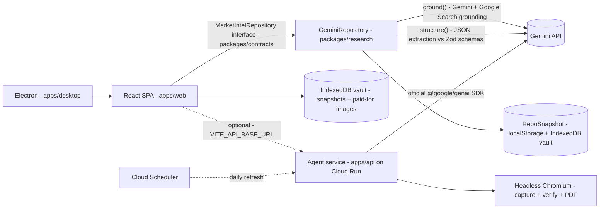

# STRATEMARK

**Living market-intelligence decks — researched from live sources, cited on every figure, self-verifying.**

Describe a market in plain language. Stratemark researches it into a deck of company cards with sourced metrics, maturity tiers (2K-style ratings — nobody scores a perfect 100), daily briefings with a card-unboxing reveal, CRO/UX site audits, and executive reports that are red-teamed against live sources before they're composed. Everything is grounded through Gemini + Google Search grounding; **nothing is ever invented** — a figure without a credible citation renders as an honest "Unknown".

Built for the **All Things Agentic** hackathon (Google Cloud, Aug 2026). See [`docs/HACKATHON-CHECKLIST.md`](docs/HACKATHON-CHECKLIST.md) before submitting.

---

## Team

| Who | Role | Owns |
|---|---|---|
| **Shannon** | CEO | Product direction, hackathon submission |
| **Tobi** | CPO & Design | Final design pass, landing page, Lemon Squeezy store — [`docs/HANDOVER-TOBI.md`](docs/HANDOVER-TOBI.md) |
| **Maruf** | CTO & Lead Engineer | Hosting, backend, auth, this repository — [`docs/HANDOVER-MARUF.md`](docs/HANDOVER-MARUF.md) |

## Quickstart

```bash
# Requirements: Node 20+, pnpm 9+
pnpm install

# Dev server (web app)
pnpm --filter @mi/web dev

# THE GATE — typecheck + lint + 385 tests. Must be green before every push.
pnpm check

# Production build (single self-contained HTML file — the preview deploy)
SINGLEFILE=1 pnpm --filter @mi/web build   # → apps/web/dist/index.html

# Open Judging Build (Google Cloud Hackathon)
# Removes the private preview access-code gate and subscription paywall.
# Connects to the live Google Cloud Run environment.
# Judges can log in using the Email/Password provided in the submission details.
VITE_OPEN_ACCESS=true pnpm --filter @mi/web build

# Electron desktop app
pnpm --filter @mi/desktop dev
```

First run: open **Settings → Google AI Studio API key** and paste a Gemini key (free tier works — [aistudio.google.com/apikey](https://aistudio.google.com/apikey)). The key lives **only in the user's browser** (localStorage) and is sent only to Google's API — never to any server of ours, never logged.

During the private preview the app is gated by **named access codes** (SHA-256 hashes in `apps/web/src/lib/access.ts`; plaintext codes live with Shannon). Google sign-in replaces this at launch — see the Maruf handover.

## Monorepo layout

```
apps/
  web/        React + Vite + Tailwind SPA (the product)
  desktop/    Electron shell (same UI, key in OS keychain, decks on disk)
  api/        Cloud Run agent service — official Google GenAI SDK, page
              capture + verification, PDF rendering, scheduled refresh.
              OPTIONAL: the apps run standalone with a user's own key.
packages/
  contracts/  Types, Zod schemas, enums — THE source of truth for all shapes
  research/   The research engine: Gemini client, grounded pipelines,
              repository (GeminiRepository), verification, briefings, audits
  mocks/      MockRepository for tests and keyless demo
docs/         Handover docs, business/subscription model, hackathon checklist
```

### Architecture (one screen)



**Two clients, one contract.** Every model call goes through the `LlmClient`
interface in `packages/research`. `gemini.ts` implements it with plain `fetch`
for the browser and Electron, where the user's own key does the work.
`genai.ts` implements the same interface on the **official Google GenAI SDK**
for the server, where a shared key or Vertex AI service-account credentials do
it. Because `LivingDeckEngine` and `runAdkTaskGraph` depend only on the
interface, the entire agent pipeline runs unchanged on either.

**The two-call pattern** powers everything: `client.ground(prompt)` runs a grounded Google-Search pass and returns text + citations; `client.structure(prompt, zodSchema)` extracts typed JSON that must parse against a Zod schema (all single-list schemas are bare-array tolerant via `z.preprocess`). Every write path is gated by the **provenance contract** (`packages/contracts/src/provenance.ts`): junk sources filtered, corrections require verification-grade citations.

### Product laws (do not break these)

1. **No fabrication.** No credible citation → honest "Unknown". Never invent, never upgrade confidence.
2. **Paid once, kept forever.** Generated images persist in the IndexedDB vault; a refresh never re-bills. One image per story serves every surface.
3. **User figures are law.** `user_verified` metrics are never challenged by any automated pass.
4. **Cost honesty.** Every model call is metered (`apps/web/src/lib/usage.ts`); the user's monthly cap triggers low-power mode that pauses autonomous spend only.
5. **The gate.** `pnpm check` green before every push. No `# TODO`s, no mock data in prod paths, no dead buttons.

## Key features → where they live

| Feature | Entry point |
|---|---|
| Deck research pipeline | `packages/research/src/pipeline.ts`, `repository.ts (createResearchedDeck)` |
| Fact-check + write-back verification | `features/factcheck/FactCheck.tsx`, `repository.ts (verifyMetric)` |
| Pre-report red-team pass | `repository.ts (redTeamReportFigures)` |
| Daily Briefing + unboxing | `features/briefing/*`, `repository.ts (generateDeckBriefing)` |
| Site audit (CRO/UX report) | `features/reports/SiteAuditView.tsx`, `repository.ts (auditSite)` |
| Share links (payload rides the URL) | `lib/share/codec.ts`, `features/share/ShareDialog.tsx`, `SharePage.tsx` |
| Generated imagery (nano-banana) | `lib/ai/aiCover.ts`, `components/media/AiCover.tsx` |
| Usage metering / spend cap | `lib/usage.ts`, Settings → Usage & billing |
| Client-side scheduler (Sentinel) | `lib/agentic/useSentinel.ts` |
| Access codes (preview lock) | `lib/access.ts`, `lib/auth/RequireAuth.tsx` |
| IndexedDB vault (data safety) | `lib/repository/vault.ts`, `lib/repository/localStore.ts` |

## Contributing (once Maruf owns the repo)

- Branch from `main`: `feat/<name>` / `fix/<name>` — never push to `main` directly.
- `pnpm check` must be green locally before the PR.
- Squash-merge only; PR description follows [`.github/PULL_REQUEST_TEMPLATE.md`](.github/PULL_REQUEST_TEMPLATE.md).
- Schema changes start in `packages/contracts` and radiate outward.

## Documents

- [`docs/HANDOVER-MARUF.md`](docs/HANDOVER-MARUF.md) — CTO handover: hosting, auth, backend punch list
- [`docs/HANDOVER-TOBI.md`](docs/HANDOVER-TOBI.md) — CPO/Design handover: design pass, landing page, Lemon Squeezy
- [`docs/HACKATHON-CHECKLIST.md`](docs/HACKATHON-CHECKLIST.md) — submission requirements + disqualification traps
- [`docs/BUSINESS-MODEL.md`](docs/BUSINESS-MODEL.md) — the two-door model, unit economics, launch sequence
- [`docs/SUBSCRIPTION-MODEL.md`](docs/SUBSCRIPTION-MODEL.md) — tiers, entitlements, Lemon Squeezy wiring
- [`docs/RESEARCH_PIPELINE.md`](docs/RESEARCH_PIPELINE.md) — the staged research pipeline in depth
